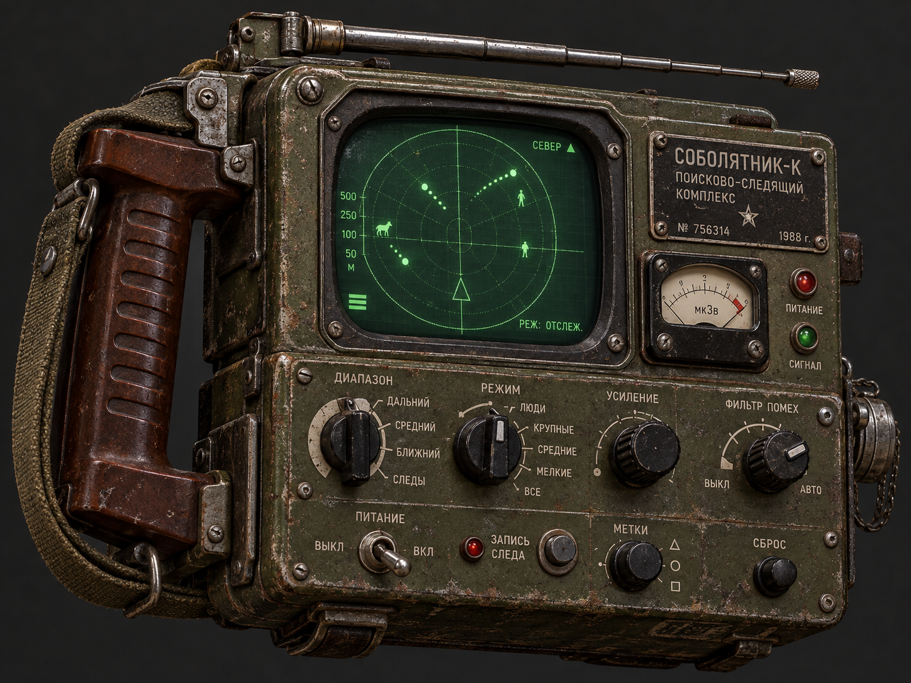

# Sobolyatnik-K — Sable Hunter 1L108K

Sobolyatnik-K is an unofficial mod for **Road to Vostok**: an in-game radar for tracking people, movement trails, and loot, plus the RtV Toolkit terminal app for managing your character while the game is closed. Not affiliated with the developer. Many thanks to Antti for making a fun game!

## Install the radar and Toolkit (Windows / Steam)

Install Road to Vostok **Steam build 25632875**, close the game, then paste this **one line into PowerShell**:

```powershell
$ErrorActionPreference='Stop'; $p=Join-Path $env:TEMP 'sobolyatnik-k-v0.1.11.ps1'; Invoke-WebRequest -UseBasicParsing -Uri 'https://github.com/jtburkh/Sobolyatnik-K/releases/download/v0.1.11-experimental/setup-sobolyatnik.ps1' -OutFile $p; if ((Get-FileHash -LiteralPath $p -Algorithm SHA256).Hash -ne 'A2CBBFA5AA1D6CCC6DA9B664CAD29ECD9A0B1BC4FDA6054E29FDF4BE13E98388') { throw 'Installer checksum mismatch; nothing was executed' }; & powershell.exe -NoProfile -ExecutionPolicy Bypass -File $p
```

The command checks the setup script's SHA-256 **before running it**. The script verifies every download, installs [official Metro Mod Loader 3.2.1](https://github.com/ametrocavich/vostok-mod-loader/releases/tag/v3.2.1) if neither loader file exists, and installs the [v0.1.11-experimental bundle](https://github.com/jtburkh/Sobolyatnik-K/releases/tag/v0.1.11-experimental): the **unchanged 0.1.8 radar VMZ** and an updated Windows x64 `rtv-toolkit.exe`. It adds Start Menu launch/uninstall shortcuts and a Windows *Installed Apps* entry. A previous verified radar-only install is adopted without overwriting Metro's config; unsupported game builds or conflicting mods are refused. **Already installed v0.1.9?** Close the game and uninstall v0.1.9 from Windows *Installed Apps* before running this command; v0.1.11 will not overwrite its receipt or executable. Uninstall retains Metro, saves and backups. See [installation and safety details](docs/windows-bundle.md).

**Uninstall:** Close the game, then choose **Uninstall Sobolyatnik-K** from the Start Menu (or *Settings → Apps → Installed apps*). Only the verified radar VMZ and Toolkit are removed; Metro, saves, and rollback backups stay. The earlier [v0.1.8 radar-only installer](docs/windows-installer.md) did not provide an uninstaller, and its release was not changed.



*AI-generated concept illustration of the fictional unit—not an in-game screenshot or an equippable item.*

## What Sobolyatnik-K does in game

The compact, dark tactical HUD shows **red enemies**, **blue Nomads**, short movement trails, and small **hollow loot markers**. `F7` cycles radar layers; `F8` hides or shows the drawing without stopping telemetry. The radar is independent of equipped inventory items and does not modify your character save.

This is an **experimental Build 2** mod, not a promise of crash-free play. Gunshot telemetry, AI sensor/vision reads, the old artifact, and summon commands are **not** part of this playable radar. Do not install the diagnostic bridge alongside it. See [stability and feature limitations](docs/telemetry-diagnostics.md).

## Toolkit: manage your character offline

The companion `rtv-toolkit` terminal program can inspect and edit character inventory and equipment, validate item placement, and check a save without opening its UI. **Close Road to Vostok before editing a save.** Before replacing a save, it checks for external changes and keeps a timestamped `.rtvbak.*` backup. Keep your own backup of important saves too.

The Windows Toolkit executable is included in the installer above and can be opened from **Start → Sobolyatnik-K → Sobolyatnik-K Toolkit**. For a source build instead, [install Rust](https://rustup.rs/) and Git:

```powershell
git clone https://github.com/jtburkh/Sobolyatnik-K.git
cd Sobolyatnik-K
cargo build --release
.\target\release\rtv-toolkit.exe
.\target\release\rtv-toolkit.exe --check
```

By default it looks for `Character.tres`; use `--save <path-to-Character.tres>` to choose another save. The **v0.1.11 executable includes [Build 2's derived inventory catalog](docs/catalog-sync.md)** (263 items, including 15 newly registered ones). The earlier v0.1.9 executable does not; install the new version to use those entries. Unknown item footprints are rejected rather than guessed. In-game slot behavior for every new item still needs a spot-check on a disposable save. Avoid `--spawn-*` commands with the current radar bridge. Run `rtv-toolkit.exe --help` for CLI options.

The terminal also has a live Radar tab (`4`) when telemetry is configured, but it is **not required** for the in-game HUD. The v0.1.11 Toolkit colors live enemy, Nomad, and boss contacts to match the in-game mod. See [telemetry configuration](docs/telemetry-installation.md) and the [protocol](docs/telemetry-protocol.md) for advanced Windows/WSL setups; do not expose the unauthenticated UDP listener outside a trusted machine.

## Develop and verify

To package the five isolated radar variants from source, install Python 3 and run `python3 tools/package_radar_lite.py`. Only `dist/probes/RtVRadarLoot.vmz` is the playable radar; the other VMZs are diagnostic variants, not additional mods to install together. The [runtime research](docs/runtime-discovery.md) and [third-party notices](THIRD_PARTY_NOTICES.md) provide further context. Neither private saves, dumps, game binaries, nor local builds are in this repository.

```bash
cargo fmt --all -- --check
cargo clippy --all-targets --all-features -- -D warnings
cargo test
python3 tools/test_radar_lite.py --engine /path/to/godot  # optional Godot 4.6.3 mock tests
```

Mock tests and limited in-game testing do not establish universal runtime stability. License: [MIT](LICENSE). Road to Vostok and its content remain the property of their respective owners.
