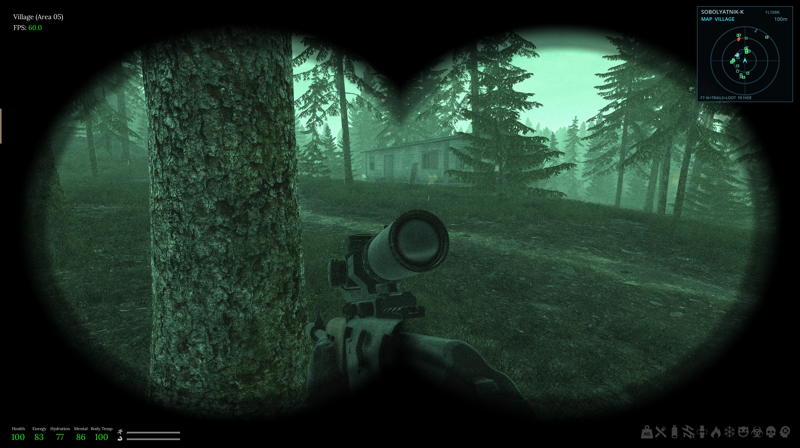
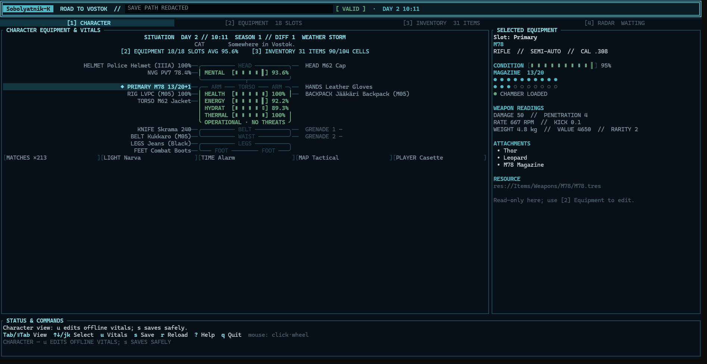
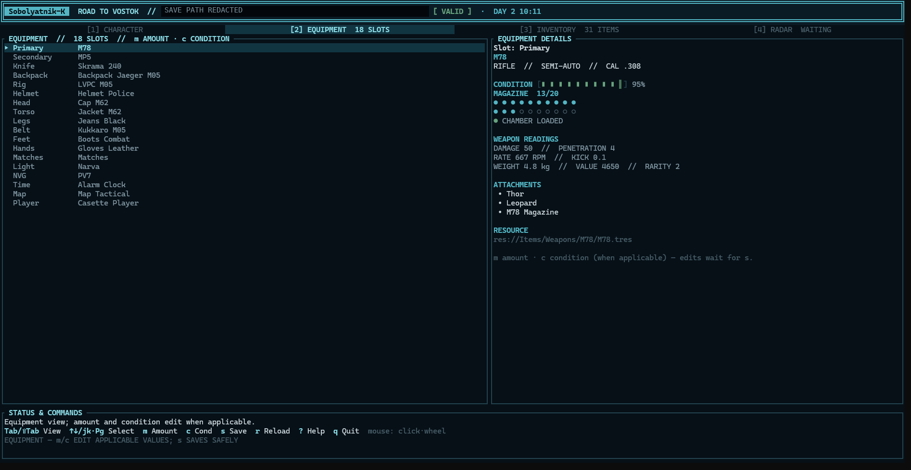
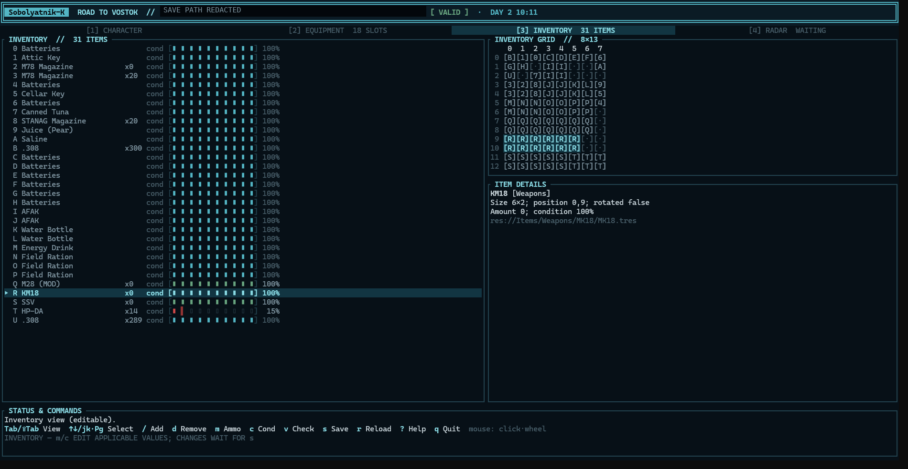
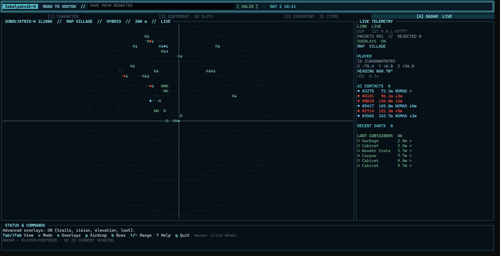

# Sobolyatnik-K — Sable Hunter 1L108K

Sobolyatnik-K is an unofficial mod for **Road to Vostok**: an in-game radar for tracking shots, people, movement trails, and loot, plus the RtV Toolkit terminal app for managing your character while the game is closed. Not affiliated with the developer. Many thanks to Antti for making a fun game!

## Install on Windows

**Close Road to Vostok**, then paste this **one line into PowerShell**. It downloads the [latest experimental Windows bundle](https://github.com/jtburkh/Sobolyatnik-K/releases/tag/v0.1.16-experimental.1), checks its SHA-256 against the release checksum, extracts the radar, Toolkit and Metro loader, and runs setup:

```powershell
$ErrorActionPreference='Stop'; $n='Sobolyatnik-K-0.1.16-experimental.1-reviewed25710663-Windows.zip'; $u='https://github.com/jtburkh/Sobolyatnik-K/releases/download/v0.1.16-experimental.1/'; $d=Join-Path $env:TEMP ('sobolyatnik-'+[guid]::NewGuid().ToString('N')); New-Item -ItemType Directory -Path $d | Out-Null; $z=Join-Path $d $n; Invoke-WebRequest -UseBasicParsing -Uri ($u+$n) -OutFile $z; Invoke-WebRequest -UseBasicParsing -Uri ($u+$n+'.sha256') -OutFile ($z+'.sha256'); $m=[regex]::Match([IO.File]::ReadAllText($z+'.sha256'), '^([a-fA-F0-9]{64})  '+[regex]::Escape($n)+'\s*$'); if (-not $m.Success -or (Get-FileHash -LiteralPath $z -Algorithm SHA256).Hash -ine $m.Groups[1].Value) { throw 'Download checksum mismatch; nothing was installed' }; Expand-Archive -LiteralPath $z -DestinationPath $d; & powershell.exe -NoProfile -ExecutionPolicy Bypass -File (Join-Path $d 'run-sobolyatnik.ps1'); if ($LASTEXITCODE -ne 0) { throw 'Sobolyatnik-K setup did not complete' }
```

The installer verifies the individual files, refuses conflicting mods and existing bundles, and will not run while the game is open. **Steam build `25710663` was reviewed. If yours differs, setup displays a warning but lets you continue; compatibility on another build is unverified.** If another Sobolyatnik-K bundle is already installed, remove it using its own uninstaller in Windows *Installed apps* before running this one. Back up any important saves before trying a new mod.

**Uninstall:** Close the game and Toolkit, then use *Settings → Apps → Installed apps → Sobolyatnik-K* (or its Start Menu shortcut). Uninstall preserves Metro, saves and backups. See the [installation guide and known limitations](docs/windows-0.1.16.md) or [download the ZIP manually](https://github.com/jtburkh/Sobolyatnik-K/releases/tag/v0.1.16-experimental.1). Older releases remain available on GitHub but are not the installation path for this build.

## In game

**Shot Alerts** is visible by default: enemy, Nomad and boss gunshots appear as fixed markers and fade after five seconds. `F7` cycles radar views (AI, trails and loot), `F8` hides/shows the HUD, and `F9` cycles 50/100/200/400 m **display** ranges. Player and vehicle shots are excluded. The range does not change AI perception or guarantee detecting gunshots at 400 m. The radar does not modify character saves.



*In-game screenshot from an earlier radar version. This release is experimental; broad combat/crash stability on newer game builds is not established.*

## Windows Toolkit

The included `rtv-toolkit.exe` provides inventory and equipment editing, a live tactical radar, and a Backups tab. Close the game before changing a save; the Toolkit makes `.rtvbak.*` backups, and restoring requires typed confirmation. Its radar `+`/`-` range control is separate from the in-game `F9` setting. See the [radar notes](docs/radar-range-preview.md) and [telemetry configuration](docs/telemetry-installation.md). Do not expose its unauthenticated localhost telemetry listener outside a trusted machine.

<details>
<summary>Toolkit screenshots</summary>






</details>

## Development and bug reports

Report problems with your Steam build ID, reproduction steps and **redacted** logs through [GitHub Issues](https://github.com/jtburkh/Sobolyatnik-K/issues); do not post private saves or recovered game resources. Source pushes require a version bump and run an advisory Steam build check; a matching build ID alone does not prove gameplay compatibility. See [runtime and safety research](docs/runtime-discovery.md), [third-party notices](THIRD_PARTY_NOTICES.md), and the [MIT license](LICENSE).
